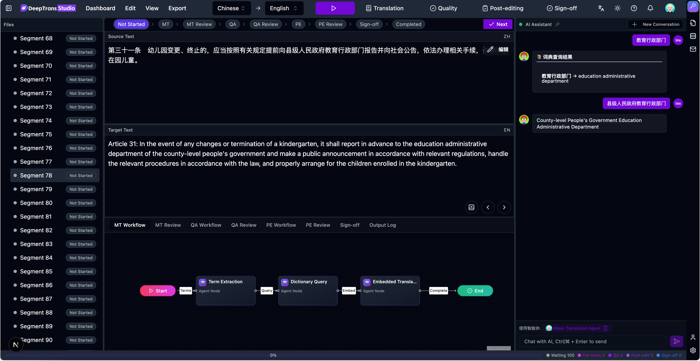
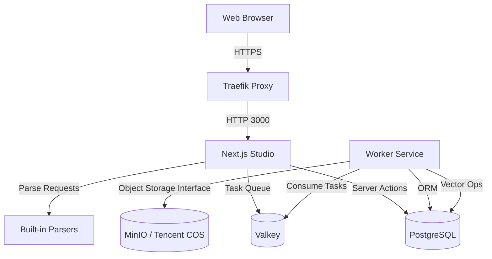

<div align="center">
  
  
  <!-- # DeepTrans Studio -->
  
  ### Professional AI-Powered Translation Workbench
  
  [](https://nextjs.org/)
  [](https://react.dev/)
  [](https://www.typescriptlang.org/)
  [](https://prisma.io/)
  [](CHANGELOG.md)
  [](https://opensource.org/licenses/MIT)
  
  [English](#) | [中文](./README_ZH.md)
  
</div>

---

## 🌟 Overview

**DeepTrans Studio** is an enterprise-grade translation platform that combines AI-powered translation, localization engineering, and team collaboration capabilities. Built for professional translators and localization teams, it provides comprehensive end-to-end translation workflow management.

<div align="center">
  
  <br/>
  <em>DeepTrans Studio User Interface</em>
</div>

## 📝 Citation

DeepTrans Studio and its document translation stack are described in our ACL '26 System Demonstrations and CSCW '26 Companion Demo papers. If you use this project in academic work, please cite:

> Yang Qi, Xiangyao Ma, Xiao Wang, Hao Wang, and Rui Wang. 2026. [BabelDOC: Better Layout-Preserving PDF Translation via Intermediate Representation](https://aclanthology.org/2026.acl-demo.25/). In _Proceedings of the 64th Annual Meeting of the Association for Computational Linguistics (Volume 3: System Demonstrations)_, pages 253-262, San Diego, California, United States. Association for Computational Linguistics.

> Ziyang Lian, Qingya Zhang, Hao Wang, Huiwen Xiong, Qi Yang, Lingyi Meng, Xiaoyi Gu, and Rui Wang. 2026. DeepTrans Studio: Turning Expert Interventions into Shared Team Knowledge in Agentic Translation Workflows. In _Proceedings of Companion of the 2026 Computer-Supported Cooperative Work and Social Computing (CSCW '26 Demo, CCF-A)_. ACM, New York, NY, USA, 4 pages. DOI forthcoming.

```bibtex
@inproceedings{qi-etal-2026-babeldoc,
  title = {{B}abel{DOC}: Better Layout-Preserving {PDF} Translation via Intermediate Representation},
  author = {Qi, Yang and Ma, Xiangyao and Wang, Xiao and Wang, Hao and Wang, Rui},
  editor = {Durrett, Greg and Jian, Ping},
  booktitle = {Proceedings of the 64th Annual Meeting of the Association for Computational Linguistics (Volume 3: System Demonstrations)},
  month = jul,
  year = {2026},
  address = {San Diego, California, United States},
  publisher = {Association for Computational Linguistics},
  url = {https://aclanthology.org/2026.acl-demo.25/},
  pages = {253--262},
  ISBN = {979-8-89176-392-0}
}

@inproceedings{lian2026deeptrans,
  title = {DeepTrans Studio: Turning Expert Interventions into Shared Team Knowledge in Agentic Translation Workflows},
  author = {Lian, Ziyang and Zhang, Qingya and Wang, Hao and Xiong, Huiwen and Yang, Qi and Meng, Lingyi and Gu, Xiaoyi and Wang, Rui},
  booktitle = {Proceedings of Companion of the 2026 Computer-Supported Cooperative Work and Social Computing (CSCW '26)},
  publisher = {ACM},
  address = {New York, NY, USA},
  year = {2026},
  pages = {4},
  note = {Demo paper; DOI forthcoming}
}
```

## ✨ Key Features

### 🎯 Translation IDE

- **Intelligent Editor**: Segment-aligned parallel editing with version control and keyboard shortcuts
- **Multi-Agent Collaboration**: Coordinate multiple AI agents for complex translation tasks
- **Real-time Preview**: Instant document preview with formatting preservation

### 🤖 AI-Powered Translation

- **Multi-Engine Support**: Integration with OpenAI and custom AI models
- **Terminology Extraction**: Automated domain-specific term extraction
- **Quality Assessment**: AI-driven grammar, syntax, and discourse evaluation
- **Translation Memory**: Vector search with pgvector and CJK keyword search with PGroonga

### 📚 Knowledge Management

- **Project Dictionaries**: Project-specific terminology databases
- **Translation Memory**: Import/export translation memory in TMX, CSV, XLSX formats
- **Semantic Search**: Vector similarity search powered by pgvector, with PGroonga keyword retrieval

### 🔄 Workflow Automation

- **Queue-Based Processing**: BullMQ-driven asynchronous task processing
- **Batch Operations**: Bulk translation, evaluation, and quality checks
- **Document Parsing**: DOCX, PDF, TXT, and Markdown parsing with MinerU online PDF parsing
- **Status Tracking**: Complete translation lifecycle management

### 🔌 Extensibility

- **Open Architecture**: Modular design with PostgreSQL, Valkey, and pluggable object storage
- **API Gateway**: RESTful APIs for external integration
- **Custom Agents**: Extensible AI agent framework
- **Plugin System**: Support for custom translation engines and processing pipelines

## 🏗️ Architecture

DeepTrans Studio adopts a modern full-stack architecture based on Next.js App Router with distributed queue processing:


```mermaid
graph TD
    Browser[Web Browser] -->|HTTPS| Traefik[Traefik Proxy]
    Traefik -->|HTTP 3000| Studio[Next.js Studio]
    Studio -->|Server Actions| Postgres[(PostgreSQL)]
    Studio -->|Task Queue| Valkey[(Valkey)]
    Studio -->|Parse Requests| Parser[Built-in Parsers]
    Worker[Worker Service] -->|Consume Tasks| Valkey
    Worker -->|ORM| Postgres
    Worker -->|Vector Ops| Postgres
    Worker -->|Object Storage Interface| Storage[(MinIO / Tencent COS)]
```

### Core Components

| Component    | Technology                                             | Purpose                                                     |
| ------------ | ------------------------------------------------------ | ----------------------------------------------------------- |
| **Studio**   | Next.js 15, React 19, TypeScript                       | Frontend UI, Server Actions, Authentication                 |
| **Worker**   | Node.js, BullMQ                                        | Background job processing, batch operations                 |
| **Database** | PostgreSQL 18, pgvector, PGroonga, Prisma 6            | Relational data, vector search, CJK keyword search, and ORM |
| **Cache**    | Valkey                                                 | Redis-protocol cache, session state, task queues            |
| **Storage**  | StorageService interface, MinIO, Tencent COS           | Document and asset storage                                  |
| **Parser**   | DOCX XML parser, MinerU online PDF parser, text parser | Document parsing for DOCX, PDF, TXT, and Markdown           |
| **Gateway**  | Traefik                                                | Reverse proxy, SSL/TLS termination                          |

## 🚀 Quick Start

### Prerequisites

- **Node.js** ≥ 18.18 (includes npm)
- **Yarn 1.22.22** (optional; use `corepack` when you want the repository lockfile)
- **Docker** & **Docker Compose** (For services and deployment)
- **Git**

### Installation

```bash
# Option A: enable Corepack and install from the repository Yarn v1 lockfile
corepack enable
corepack prepare yarn@1.22.22 --activate
yarn install

# Option B instead of Option A: npm also supports the guarded local-development scripts
npm install
```

### Local Development (isolated)

Local development uses `.env.local` and `docker-compose.dev.yml`; it never edits the production-style `.env`. PostgreSQL, Valkey, MinIO's S3 API, and the MinIO Console bind only to loopback ports `55432`, `56379`, `59002`, and `59003`. `NEXTAUTH_URL` must be an `http` loopback URL on port `3000`. The helper rejects a non-local address, TCP/remote Docker daemon, or any database other than `deeptrans_local`.

```bash
# If dependencies are not installed yet, use either npm install or Yarn v1 above.

# Create the safe local profile and replace AUTH_SECRET with a random local value
cp .env.local.example .env.local

# Generate a local-only AUTH_SECRET in every supported shell, then paste it into .env.local.
# This command only prints a random value; it never reads or writes .env.local.
npm run local:secret

# First-time setup: starts isolated dependencies, migrates only deeptrans_local,
# and creates the demo account
npm run local:setup

# Read-only readiness verification after setup
npm run local:check

# Start the web app; demo sign-in uses test@example.com and the fixed
# verification code 123456 (not a password)
# (yarn dev uses the same isolated runner)
# Port 3000 must be free: the runner refuses Next's automatic 3001 fallback,
# because the validated local auth and API URLs intentionally stay on 3000.
npm run dev

# Translation-memory imports, vector backfills, and other queued workflows
# require the Worker in another terminal
npm run worker

# Optional: start the guarded Web app and Worker together in one terminal
npm run dev:all
```

For a first install, run `local:setup` before `local:check`: setup starts the owned dependencies itself, applies migrations, creates the demo account, and creates the owned local storage bucket. `local:check` is read-only and verifies that PostgreSQL, Valkey, and both MinIO ports belong to the `deeptrans-local` Compose project and map to the exact loopback ports, then checks local credentials, storage-bucket readiness, and migration status. Use `local:up` only to start already-initialized dependencies or while diagnosing startup; it never replaces setup. The guarded app and worker receive only the validated local profile, so shell variables or a production-style `.env` cannot re-enable remote services. SMTP, COS, and remote AI are disabled by default. The translation-memory vector contract is fixed at 2048 dimensions. Translation-memory imports, vector backfills, and other queued workflows require `npm run worker`; when it is unavailable, queued work remains durable and resumes after the Worker becomes ready. To use remote AI deliberately, set `LOCAL_ALLOW_REMOTE_AI=yes` and provide development-only credentials in `.env.local`.

The fixed `test@example.com` / `123456` demo credential is active only when `IS_DEMO=yes`; a normal runtime follows the regular mailbox-verification path and never creates or accepts that demo account.

`npm run dev` also refuses to start when port `3000` is already occupied on either loopback family. Do not rely on Next.js choosing `3001`: the local profile deliberately keeps authentication and internal API URLs fixed at port `3000`.

After the Web process starts, `GET http://localhost:3000/api/health` returns `{ "status": "ok", "scope": "web" }` only when that process can serve a route. It deliberately does not claim that PostgreSQL, storage, Valkey, or the Worker is ready; use `npm run local:check` and the relevant workflow status for those checks.

Additional UIs:

- **Studio**: http://localhost:3000
- **MinIO Console**: http://127.0.0.1:59003
- **Database readiness**: Run `npm run local:check`. Direct Prisma CLI commands are intentionally not part of the safe local-start path.

### Production Deployment

```bash
# Configure environment
cp .env.example .env.production
# Edit .env.production with production values
#
# Required object storage settings for production:
# STORAGE_TYPE=cos
# COS_SECRET_ID=AKIDxxxxxxxx
# COS_SECRET_KEY=xxxxxxxx
# COS_BUCKET=deeptrans-1250000000
# COS_REGION=ap-guangzhou

# Use one explicit Compose project and environment file. The same file is passed
# both for Compose interpolation and into the app/worker/migration containers.
export DEPLOY_ENV_FILE=.env.production
# When upgrading a host that only has the legacy .env, explicitly keep
# DEPLOY_ENV_FILE=.env until the complete production file has been copied and checked.
docker compose -p deeptrans-studio --env-file "$DEPLOY_ENV_FILE" -f docker-compose-prod.yml \
  build db migrate app app_worker

# Stop ingress and the old worker before upgrading. Keep db/valkey available so
# an old worker cannot write during the migration window.
docker compose -p deeptrans-studio --env-file "$DEPLOY_ENV_FILE" -f docker-compose-prod.yml \
  stop traefik app app_worker

# Start only database and queue services, then run the migration by itself.
# Do not start the new app/worker yet.
docker compose -p deeptrans-studio --env-file "$DEPLOY_ENV_FILE" -f docker-compose-prod.yml \
  up -d db valkey
docker compose -p deeptrans-studio --env-file "$DEPLOY_ENV_FILE" -f docker-compose-prod.yml \
  run --rm --no-deps migrate

# Required when upgrading from a version that predates import receipts and
# reservations. Preserve/review a Redis/BullMQ snapshot before acknowledging
# pruned history; provide its credential-free reference and SHA-256 below.
# Retain the audit output with the deployment record. Unresolved legacy jobs
# become one durable gate per job.
export LEGACY_QUEUE_SNAPSHOT=/secure-backups/deeptrans-memory-import-before-upgrade.rdb
export LEGACY_QUEUE_SNAPSHOT_SHA256=replace_with_the_actual_64_character_sha256
docker compose -p deeptrans-studio --env-file "$DEPLOY_ENV_FILE" -f docker-compose-prod.yml \
  run --rm --no-deps migrate npx tsx scripts/memory-import-upgrade-audit.ts \
  --live --apply --legacy-history-proof=queue-snapshot-and-pruned-history-reviewed \
  --legacy-queue-snapshot="$LEGACY_QUEUE_SNAPSHOT" \
  --legacy-queue-snapshot-sha256="$LEGACY_QUEUE_SNAPSHOT_SHA256"

# Only after migration and audit succeed, restore ingress, app, and worker.
# MinIO is intentionally not started in production.
docker compose -p deeptrans-studio --env-file "$DEPLOY_ENV_FILE" -f docker-compose-prod.yml \
  up -d traefik app app_worker

# Services will be available on configured domain with SSL via Traefik.
```

`memory-import-upgrade-audit.ts` refuses all database/Redis connections unless `--live` is supplied in this stopped deployment window. With `--live`, it is read-only by default and exits non-zero while legacy jobs still need gates. It cannot reconstruct jobs that Redis has already pruned, so `--apply` additionally requires a credential-free snapshot reference and its SHA-256; both are printed in the audit record and must be retained with the deployment. The generated gates do not declare old work successful; the current memory owner must review and release each one. An old job remains write-blocked if it is processed by the upgraded worker even if an administrator manually retries it. The barrier cannot retroactively control an old image or external queue consumer, so verify every old worker is stopped before the migration window.

Production service set:

- `db`: PostgreSQL 18 with pgvector and PGroonga
- `valkey`: Redis-protocol cache and BullMQ runtime
- `migrate`: one-shot Prisma migration gate, required before app startup
- `app`: DeepTrans Studio web application
- `app_worker`: background worker
- `traefik`: HTTPS reverse proxy
- Tencent COS: external object storage configured through environment variables

## 📁 Project Structure

```
deeptrans-studio/
├── src/
│   ├── app/                    # Next.js App Router
│   │   ├── (app)/              # Main application pages
│   │   ├── api/                # API routes (migrating to Server Actions)
│   │   └── layout.tsx          # Root layout and providers
│   ├── actions/                # Server Actions (database, AI, files)
│   ├── agents/                 # AI agent definitions and prompts
│   ├── components/             # Reusable UI components
│   ├── hooks/                  # Custom React hooks
│   ├── lib/                    # Utility functions and clients
│   ├── store/                  # State management (Zustand)
│   ├── db/                     # Database client and repositories
│   ├── types/                  # TypeScript type definitions
│   └── worker/                 # Background worker tasks
├── prisma/                     # Database schema and migrations
│   ├── schema.prisma           # Prisma schema definition
│   └── migrations/             # Database migration files
├── scripts/                    # Development and utility scripts
├── public/                     # Static assets
├── docker-compose.dev.yml      # Isolated local PostgreSQL, Valkey, and MinIO
├── docker-compose-prod.yml     # Production deployment services
├── docker-compose.yml          # Legacy compatibility; not the local-start path
├── Dockerfile                  # Container image definition
└── package.json                # Project dependencies
```

## 🛠️ Available Scripts

| Command               | Description                                                                |
| --------------------- | -------------------------------------------------------------------------- |
| `npm run local:check` | Read-only validation of the isolated local profile                         |
| `npm run local:up`    | Start already-initialized owned dependencies for recovery or diagnosis     |
| `npm run local:secret` | Print a local random AUTH_SECRET without reading or writing `.env.local` |
| `npm run local:setup` | Migrate only `deeptrans_local` and create the demo account                 |
| `npm run dev`         | Start the guarded local Next.js server with hot reload                     |
| `npm run worker`      | Start the guarded local worker required by memory imports and queued work  |
| `npm run dev:all`     | Start the guarded Web app and Worker together                              |
| `yarn build`          | Build production Next.js application                                       |
| `yarn build:worker`   | Compile worker service (esbuild → dist/worker.cjs)                         |
| `yarn start`          | Start production Next.js server                                            |
| `yarn lint`           | Run ESLint code quality checks                                             |
| `yarn type-check`     | Run TypeScript type checking                                               |
| `yarn db:studio`      | Advanced command; uses the current shell environment, not the local runner |
| `yarn db:migrate`     | Advanced command; targets the current shell database, not local dev        |
| `yarn db:push`        | Advanced command; targets the current shell database, not local dev        |
| `yarn db:seed`        | Advanced command; targets the current shell database, not local dev        |
| `yarn test:docx`      | Test document parsing                                                      |
| `yarn queue:ui`       | Launch Bull Board queue monitoring                                         |

## 🌍 Internationalization

DeepTrans Studio uses [next-intl](https://next-intl-docs.vercel.app/) for internationalization:

- Translation files: `src/i18n/en.json`, `src/i18n/zh.json`
- Usage: `useTranslations('namespace')` hook
- Supported languages: English, Chinese (extendable)

When adding new translations, ensure all language files are updated consistently.

## 🤝 Contributing

We welcome contributions! Please follow these guidelines:

### Branch Strategy

- `feat/*` - New features
- `fix/*` - Bug fixes
- `chore/*` - Maintenance tasks
- `docs/*` - Documentation updates

### Development Workflow

1. **Fork & Clone**: Fork the repository and clone your fork
2. **Create Branch**: Create a feature branch from `main`
3. **Code Changes**: Make your changes following our coding standards
4. **Quality Checks**: Run linting and type checking
    ```bash
    yarn lint
    yarn type-check
    ```
5. **Commit**: Use [Conventional Commits](https://www.conventionalcommits.org/) format
    ```
    feat: add translation memory import
    fix: resolve authentication bug
    docs: update installation guide
    ```
6. **Pull Request**: Submit PR with clear description

### Code Standards

- Follow ESLint and Prettier configurations
- Write TypeScript with proper types (avoid `any`)
- Add JSDoc comments for complex functions
- Write unit tests for new features
- Update documentation as needed

## 📄 License

This project is licensed under the MIT License - see the [LICENSE](LICENSE) file for details.

## 🙏 Acknowledgments

Built with modern technologies:

- [Next.js](https://nextjs.org/) - React framework
- [Prisma](https://www.prisma.io/) - Database ORM
- [pgvector](https://github.com/pgvector/pgvector) - PostgreSQL vector search
- [PGroonga](https://pgroonga.github.io/) - CJK-capable PostgreSQL full-text search
- [BullMQ](https://docs.bullmq.io/) - Job queues
- [MinIO](https://min.io/) / Tencent COS - Object storage
- [Traefik](https://traefik.io/) - Reverse proxy

## 📞 Support

- **Issues**: [GitHub Issues](https://github.com/yourusername/deeptrans-studio/issues)
- **Discussions**: [GitHub Discussions](https://github.com/yourusername/deeptrans-studio/discussions)
- **Documentation**: Check the `/docs` folder for detailed guides

---

<div align="center">
  
  Made with ❤️ for professional translators and localization teams
  
  ⭐ Star us on GitHub if you find this project useful!
  
</div>
