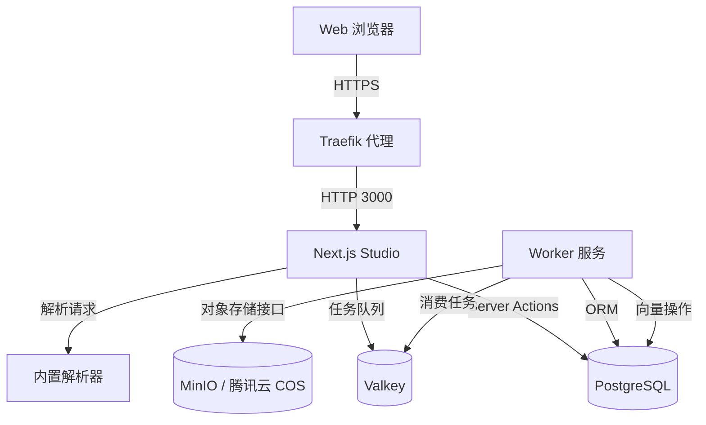

<div align="center">
  
  
  <!-- # DeepTrans Studio -->
  
  ### 专业的 AI 智能翻译工作台
  
  [](https://nextjs.org/)
  [](https://react.dev/)
  [](https://www.typescriptlang.org/)
  [](https://prisma.io/)
  [](CHANGELOG.md)
  [](https://opensource.org/licenses/MIT)
  
  [English](./README.md) | [中文](#)
  
</div>

---

## 🌟 项目简介

**DeepTrans Studio** 是一套企业级智能翻译平台，融合了 AI 翻译、本地化工程与团队协作能力。专为专业译员与本地化团队打造，提供完整的端到端翻译工作流管理。

<div align="center">
  
  <br/>
  <em>DeepTrans Studio 用户界面</em>
</div>

## 📝 论文引用

DeepTrans Studio 及其文档翻译技术栈已在 ACL '26 System Demonstrations 与 CSCW '26 Companion Demo 论文中介绍。如果你在学术工作中使用本项目，请引用：

> Yang Qi, Xiangyao Ma, Xiao Wang, Hao Wang, and Rui Wang. 2026. [BabelDOC: Better Layout-Preserving PDF Translation via Intermediate Representation](https://aclanthology.org/2026.acl-demo.25/). In _Proceedings of the 64th Annual Meeting of the Association for Computational Linguistics (Volume 3: System Demonstrations)_, pages 253-262, San Diego, California, United States. Association for Computational Linguistics.

> Ziyang Lian, Qingya Zhang, Hao Wang, Huiwen Xiong, Qi Yang, Lingyi Meng, Xiaoyi Gu, and Rui Wang. 2026. DeepTrans Studio: Turning Expert Interventions into Shared Team Knowledge in Agentic Translation Workflows. In _Proceedings of Companion of the 2026 Computer-Supported Cooperative Work and Social Computing (CSCW '26 Demo, CCF-A)_. ACM, New York, NY, USA, 4 pages. DOI forthcoming.

```bibtex
@inproceedings{qi-etal-2026-babeldoc,
  title = {{B}abel{DOC}: Better Layout-Preserving {PDF} Translation via Intermediate Representation},
  author = {Qi, Yang and Ma, Xiangyao and Wang, Xiao and Wang, Hao and Wang, Rui},
  editor = {Durrett, Greg and Jian, Ping},
  booktitle = {Proceedings of the 64th Annual Meeting of the Association for Computational Linguistics (Volume 3: System Demonstrations)},
  month = jul,
  year = {2026},
  address = {San Diego, California, United States},
  publisher = {Association for Computational Linguistics},
  url = {https://aclanthology.org/2026.acl-demo.25/},
  pages = {253--262},
  ISBN = {979-8-89176-392-0}
}

@inproceedings{lian2026deeptrans,
  title = {DeepTrans Studio: Turning Expert Interventions into Shared Team Knowledge in Agentic Translation Workflows},
  author = {Lian, Ziyang and Zhang, Qingya and Wang, Hao and Xiong, Huiwen and Yang, Qi and Meng, Lingyi and Gu, Xiaoyi and Wang, Rui},
  booktitle = {Proceedings of Companion of the 2026 Computer-Supported Cooperative Work and Social Computing (CSCW '26)},
  publisher = {ACM},
  address = {New York, NY, USA},
  year = {2026},
  pages = {4},
  note = {Demo paper; DOI forthcoming}
}
```

## ✨ 核心功能

### 🎯 翻译 IDE

- **智能编辑器**：段落对齐的平行编辑，支持版本控制和快捷键操作
- **多智能体协同**：协调多个 AI 智能体处理复杂翻译任务
- **实时预览**：即时文档预览，保留原始格式

### 🤖 AI 驱动翻译

- **多引擎支持**：集成 OpenAI 及自定义 AI 模型
- **术语提取**：自动提取领域专业术语
- **质量评估**：AI 驱动的语法、句法和语篇评估
- **翻译记忆**：基于 pgvector 的向量检索和基于 PGroonga 的 CJK 关键词检索

### 📚 知识管理

- **项目词典**：项目专属术语数据库
- **翻译记忆**：支持 TMX、CSV、XLSX 格式导入导出
- **语义搜索**：基于 pgvector 的向量相似度搜索，结合 PGroonga 关键词检索

### 🔄 工作流自动化

- **队列处理**：基于 BullMQ 的异步任务处理
- **批量操作**：批量翻译、评估和质量检查
- **文档解析**：使用 MinerU 在线解析 PDF，并处理 DOCX、TXT 与 Markdown
- **状态追踪**：完整的翻译生命周期管理

### 🔌 可扩展性

- **开放架构**：模块化设计，集成 PostgreSQL、Valkey 与可插拔对象存储
- **API 网关**：提供 RESTful API 用于外部集成
- **自定义智能体**：可扩展的 AI 智能体框架
- **插件系统**：支持自定义翻译引擎和处理流程

## 🏗️ 系统架构

DeepTrans Studio 采用基于 Next.js App Router 的现代全栈架构，配合分布式队列处理：


```mermaid
graph TD
    Browser[Web 浏览器] -->|HTTPS| Traefik[Traefik 代理]
    Traefik -->|HTTP 3000| Studio[Next.js Studio]
    Studio -->|Server Actions| Postgres[(PostgreSQL)]
    Studio -->|任务队列| Valkey[(Valkey)]
    Studio -->|解析请求| Parser[内置解析器]
    Worker[Worker 服务] -->|消费任务| Valkey
    Worker -->|ORM| Postgres
    Worker -->|向量操作| Postgres
    Worker -->|对象存储接口| Storage[(MinIO / 腾讯云 COS)]
```

### 核心组件

| 组件       | 技术栈                                              | 用途                                       |
| ---------- | --------------------------------------------------- | ------------------------------------------ |
| **Studio** | Next.js 15, React 19, TypeScript                    | 前端 UI、Server Actions、身份验证          |
| **Worker** | Node.js, BullMQ                                     | 后台任务处理、批量操作                     |
| **数据库** | PostgreSQL 18, pgvector, PGroonga, Prisma 6         | 关系型数据、向量检索、CJK 关键词检索与 ORM |
| **缓存**   | Valkey                                              | Redis 协议缓存、任务队列                   |
| **存储**   | StorageService 接口、MinIO、腾讯云 COS              | 文档和资源存储                             |
| **解析器** | DOCX XML 解析器、MinerU 在线 PDF 解析器、文本解析器 | 解析 DOCX、PDF、TXT 与 Markdown            |
| **网关**   | Traefik                                             | 反向代理、SSL/TLS 终端                     |

## 🚀 快速开始

### 前置要求

- **Node.js** ≥ 18.18（内含 npm）
- **Yarn 1.22.22**（可选；需要使用仓库锁文件时通过 `corepack` 启用）
- **Docker** & **Docker Compose**（用于服务和部署）
- **Git**

### 安装依赖

```bash
# 方案 A：启用 Corepack，按仓库 Yarn v1 锁文件安装
corepack enable
corepack prepare yarn@1.22.22 --activate
yarn install

# 方案 B（不要与方案 A 同时执行）：npm 同样支持受保护的本地开发脚本
npm install
```

### 本地开发（隔离环境）

本地开发使用 `.env.local` 与 `docker-compose.dev.yml`，不会读取或改写生产 `.env`。数据库、Valkey、MinIO S3 API 与 MinIO Console 都只绑定回环地址，分别使用 `55432`、`56379`、`59002` 和 `59003`；`NEXTAUTH_URL` 必须是端口 `3000` 上的 `http` 回环地址。脚本会拒绝非本机地址、TCP/远程 Docker daemon 或非 `deeptrans_local` 数据库。

```bash
# 如尚未安装依赖，使用上方的 npm install 或 Yarn v1 方案即可。

# 复制安全的本地模板，并把 AUTH_SECRET 改成随机本地值
cp .env.local.example .env.local

# 在所有受支持的终端生成仅供本地使用的 AUTH_SECRET，再将输出粘贴到 .env.local。
# 该命令只打印随机值，不会读取或写入 .env.local；不可复用生产密钥。
npm run local:secret

# 首次初始化：启动隔离依赖，仅对 deeptrans_local 执行迁移并创建演示账号
npm run local:setup

# 初始化后执行只读就绪检查
npm run local:check

# 启动 Web；演示登录使用 test@example.com 和固定验证码 123456（不是密码）
# （yarn dev 会走同一隔离启动器）
# 端口 3000 必须空闲：启动器会拒绝 Next 自动切换到 3001，
# 因为已校验的本地认证和 API 地址固定使用 3000。
npm run dev

# 翻译记忆导入、向量回填和其他队列工作流需要在另一个终端运行 Worker
npm run worker

# 可选：在一个终端中同时启动受保护的 Web 与 Worker
npm run dev:all
```

首次安装应先运行 `local:setup`，再运行 `local:check`：setup 会自行启动受管依赖、执行迁移、创建演示账号和所属本地存储 bucket。`local:check` 不写入任何数据，并检查 PostgreSQL、Valkey、MinIO 的两个端口是否确属 `deeptrans-local` Compose 项目且精确映射到回环地址，以及本地凭据、存储 bucket 就绪状态和迁移状态。`local:up` 只用于启动已初始化的受管依赖或排查启动问题，不能替代 setup。受保护的 app 与 worker 只接收校验过的本地配置，shell 变量或生产式 `.env` 不能重新启用远程服务。默认禁用 SMTP、COS 和远程 AI；翻译记忆的向量维度固定为 2048。翻译记忆导入、向量回填和其他队列工作流需要 `npm run worker`；Worker 暂不可用时，任务会保留在队列中，待 Worker 就绪后继续。需要远程 AI 时，明确在 `.env.local` 设置 `LOCAL_ALLOW_REMOTE_AI=yes` 及对应本地开发凭据。

固定的 `test@example.com` / `123456` 演示凭据仅在 `IS_DEMO=yes` 时启用；正常运行环境一律走真实邮箱验证码链路，不会创建或接受该演示账号。

`npm run dev` 还会检查回环地址上的 `3000` 端口是否被占用；若已有监听进程，脚本会明确失败。不要依赖 Next 自动切换到 `3001`：本地认证和内部 API 地址有意固定在 `3000`。

Web 进程启动后，访问 `GET http://localhost:3000/api/health` 会返回 `{ "status": "ok", "scope": "web" }`，这只表示 Web 路由可以响应；它不表示 PostgreSQL、对象存储、Valkey 或 Worker 已就绪。前者仍使用 `npm run local:check`，队列任务还应查看对应工作流状态。

可用界面：

- **Studio**: http://localhost:3000
- **MinIO Console**: http://127.0.0.1:59003
- **数据库就绪检查**：运行 `npm run local:check`。直接执行 Prisma CLI 不属于安全的本地启动路径。

### 生产部署

```bash
# 配置环境变量
cp .env.example .env.production
# 编辑 .env.production 填写生产环境配置
#
# 生产对象存储必填：
# STORAGE_TYPE=cos
# COS_SECRET_ID=AKIDxxxxxxxx
# COS_SECRET_KEY=xxxxxxxx
# COS_BUCKET=deeptrans-1250000000
# COS_REGION=ap-guangzhou

# 固定 Compose 项目名并显式传入同一份生产环境文件；该文件既用于 Compose
# 变量替换，也会注入 app、worker 与迁移容器。
export DEPLOY_ENV_FILE=.env.production
# 若升级的旧主机只有 .env，请先显式保留 DEPLOY_ENV_FILE=.env；完整复制并核对
# .env.production 后再切换，且不要提交任一真实环境文件。
docker compose -p deeptrans-studio --env-file "$DEPLOY_ENV_FILE" -f docker-compose-prod.yml \
  build db migrate app app_worker

# 升级前先停止入口和旧 worker；保留 db/valkey，避免旧 worker 在迁移期间继续写入。
docker compose -p deeptrans-studio --env-file "$DEPLOY_ENV_FILE" -f docker-compose-prod.yml \
  stop traefik app app_worker

# 只启动数据库与队列，单独完成迁移；此时不要启动新 app/worker。
docker compose -p deeptrans-studio --env-file "$DEPLOY_ENV_FILE" -f docker-compose-prod.yml \
  up -d db valkey
docker compose -p deeptrans-studio --env-file "$DEPLOY_ENV_FILE" -f docker-compose-prod.yml \
  run --rm --no-deps migrate

# 仅在从“导入回执/预约”之前的旧版本升级时：先保留 Redis/BullMQ 快照并核查
# 已被清理的历史任务，再执行审计；下方必须写入不含凭据的快照位置与 SHA-256，
# 并把审计输出与部署记录一同留存。无回执的旧任务会物化为逐任务的安全门禁。
# 未完成此步骤，不得启动新 app/worker。
export LEGACY_QUEUE_SNAPSHOT=/secure-backups/deeptrans-memory-import-before-upgrade.rdb
export LEGACY_QUEUE_SNAPSHOT_SHA256=replace_with_the_actual_64_character_sha256
docker compose -p deeptrans-studio --env-file "$DEPLOY_ENV_FILE" -f docker-compose-prod.yml \
  run --rm --no-deps migrate npx tsx scripts/memory-import-upgrade-audit.ts \
  --live --apply --legacy-history-proof=queue-snapshot-and-pruned-history-reviewed \
  --legacy-queue-snapshot="$LEGACY_QUEUE_SNAPSHOT" \
  --legacy-queue-snapshot-sha256="$LEGACY_QUEUE_SNAPSHOT_SHA256"

# 审计与迁移均成功后，才开放入口、应用和新 worker；生产环境不启动 MinIO。
docker compose -p deeptrans-studio --env-file "$DEPLOY_ENV_FILE" -f docker-compose-prod.yml \
  up -d traefik app app_worker

# 服务将在配置的域名上通过 Traefik 提供 SSL 访问。
```

`memory-import-upgrade-audit.ts` 未显式传入 `--live` 时拒绝连接数据库和 Redis；只能在上述已停旧 worker 的部署窗口中加入该参数。带 `--live` 时默认仍为只读检查；若仍有旧任务而未加 `--apply`，它会非零退出。它无法凭空恢复已经被 Redis 清理的旧任务，因此 `--apply` 除 `--legacy-history-proof` 外还要求不含凭据的快照位置和 SHA-256；两者会写入审计输出，必须与部署记录一同留存。脚本生成的门禁不会声明旧任务成功；当前记忆库所有者必须核查后逐项解除。旧 job 被升级后的 worker 处理时，即使管理员人工重跑也会被 tombstone 拒绝写入；该门禁无法追溯控制旧镜像或外部队列消费者，因此迁移窗口前必须确认所有旧 worker 均已停止。

生产服务集合：

- `db`：PostgreSQL 18 + pgvector + PGroonga
- `valkey`：Redis 协议缓存与 BullMQ 运行时
- `migrate`：一次性 Prisma 迁移门禁，应用启动前必须成功完成
- `app`：DeepTrans Studio Web 应用
- `app_worker`：后台任务 worker
- `traefik`：HTTPS 反向代理
- 腾讯云 COS：通过环境变量配置的外部对象存储

## 📁 项目结构

```
deeptrans-studio/
├── src/
│   ├── app/                    # Next.js App Router
│   │   ├── (app)/              # 主应用页面
│   │   ├── api/                # API 路由（逐步迁移至 Server Actions）
│   │   └── layout.tsx          # 根布局与 providers
│   ├── actions/                # Server Actions（数据库、AI、文件）
│   ├── agents/                 # AI 智能体定义与提示词
│   ├── components/             # 可复用 UI 组件
│   ├── hooks/                  # 自定义 React Hooks
│   ├── lib/                    # 工具函数与客户端
│   ├── store/                  # 状态管理（Zustand）
│   ├── db/                     # 数据库客户端与仓储
│   ├── types/                  # TypeScript 类型定义
│   └── worker/                 # 后台 Worker 任务
├── prisma/                     # 数据库模式与迁移
│   ├── schema.prisma           # Prisma 模式定义
│   └── migrations/             # 数据库迁移文件
├── scripts/                    # 开发与工具脚本
├── public/                     # 静态资源
├── docker-compose.dev.yml      # 隔离的本地 PostgreSQL、Valkey 与 MinIO
├── docker-compose-prod.yml     # 生产部署服务
├── docker-compose.yml          # 兼容旧配置；不作为本地启动路径
├── Dockerfile                  # 容器镜像定义
└── package.json                # 项目依赖
```

## 🛠️ 常用脚本

| 命令                  | 说明                                                |
| --------------------- | --------------------------------------------------- |
| `npm run local:check` | 只读校验隔离本地配置                                |
| `npm run local:up`    | 为恢复或排查启动已初始化的受管本地依赖              |
| `npm run local:secret` | 仅打印本地随机 AUTH_SECRET，不读取或写入 `.env.local` |
| `npm run local:setup` | 仅迁移 `deeptrans_local` 并创建演示账号             |
| `npm run dev`         | 通过受保护的本地启动器启动 Next.js 热更新服务器     |
| `npm run worker`      | 启动翻译记忆导入及队列工作流所需的受保护 Worker     |
| `npm run dev:all`     | 同时启动受保护的 Web 与 Worker                       |
| `yarn build`          | 构建生产版本 Next.js 应用                           |
| `yarn build:worker`   | 编译 Worker 服务（esbuild → dist/worker.cjs）       |
| `yarn start`          | 启动生产模式 Next.js 服务器                         |
| `yarn lint`           | 运行 ESLint 代码质量检查                            |
| `yarn type-check`     | 运行 TypeScript 类型检查                            |
| `yarn db:studio`      | 高级命令：使用当前 shell 环境，不经过本地启动器     |
| `yarn db:migrate`     | 高级命令；使用当前 shell 数据库，不属于本地开发路径 |
| `yarn db:push`        | 高级命令；使用当前 shell 数据库，不属于本地开发路径 |
| `yarn db:seed`        | 高级命令；使用当前 shell 数据库，不属于本地开发路径 |
| `yarn test:docx`      | 测试文档解析                                        |
| `yarn queue:ui`       | 启动 Bull Board 队列监控                            |

## 🌍 国际化

DeepTrans Studio 使用 [next-intl](https://next-intl-docs.vercel.app/) 进行国际化：

- 翻译文件：`src/i18n/en.json`、`src/i18n/zh.json`
- 使用方式：`useTranslations('namespace')` Hook
- 支持语言：英语、中文（可扩展）

添加新翻译时，请确保所有语言文件同步更新。

## 🤝 参与贡献

我们欢迎贡献！请遵循以下指引：

### 分支策略

- `feat/*` - 新功能
- `fix/*` - Bug 修复
- `chore/*` - 维护任务
- `docs/*` - 文档更新

### 开发流程

1. **Fork & Clone**：Fork 仓库并克隆到本地
2. **创建分支**：从 `main` 创建功能分支
3. **代码修改**：按照编码规范进行修改
4. **质量检查**：运行代码检查和类型检查
    ```bash
    yarn lint
    yarn type-check
    ```
5. **提交代码**：使用 [Conventional Commits](https://www.conventionalcommits.org/) 格式
    ```
    feat: 添加翻译记忆导入功能
    fix: 修复身份验证 Bug
    docs: 更新安装指南
    ```
6. **提交 PR**：提交 Pull Request 并附上清晰的描述

### 代码规范

- 遵循 ESLint 和 Prettier 配置
- 编写带有正确类型的 TypeScript（避免使用 `any`）
- 为复杂函数添加 JSDoc 注释
- 为新功能编写单元测试
- 及时更新文档

## 📄 开源协议

本项目采用 MIT 协议 - 详见 [LICENSE](LICENSE) 文件。

## 🙏 致谢

基于以下现代技术构建：

- [Next.js](https://nextjs.org/) - React 框架
- [Prisma](https://www.prisma.io/) - 数据库 ORM
- [pgvector](https://github.com/pgvector/pgvector) - PostgreSQL 向量检索
- [PGroonga](https://pgroonga.github.io/) - 支持 CJK 的 PostgreSQL 全文检索
- [BullMQ](https://docs.bullmq.io/) - 任务队列
- [MinIO](https://min.io/) / 腾讯云 COS - 对象存储
- [Traefik](https://traefik.io/) - 反向代理

## 📞 支持

- **Issues**：[GitHub Issues](https://github.com/yourusername/deeptrans-studio/issues)
- **讨论**：[GitHub Discussions](https://github.com/yourusername/deeptrans-studio/discussions)
- **文档**：查看 `/docs` 文件夹获取详细指南

---

<div align="center">
  
  为专业译员和本地化团队倾心打造 ❤️
  
  ⭐ 如果觉得有用，请在 GitHub 上给我们一个 Star！
  
</div>
